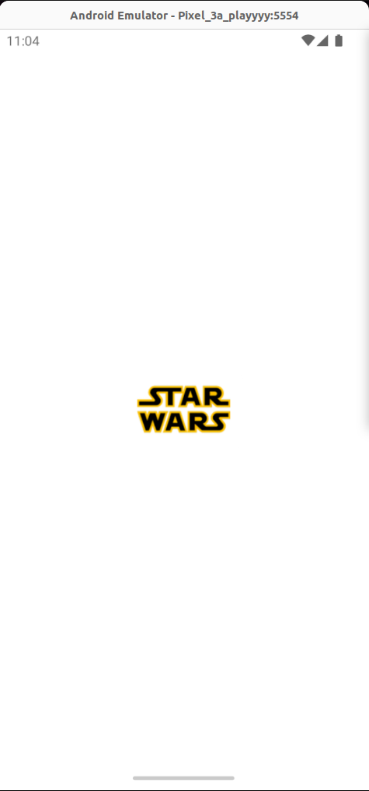
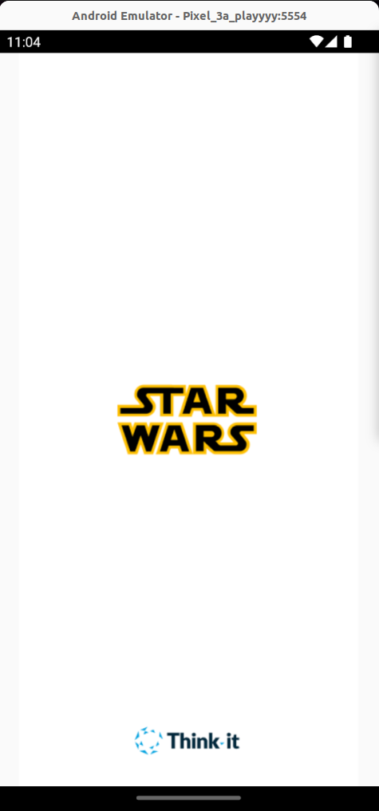
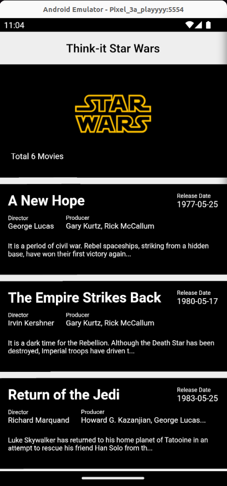
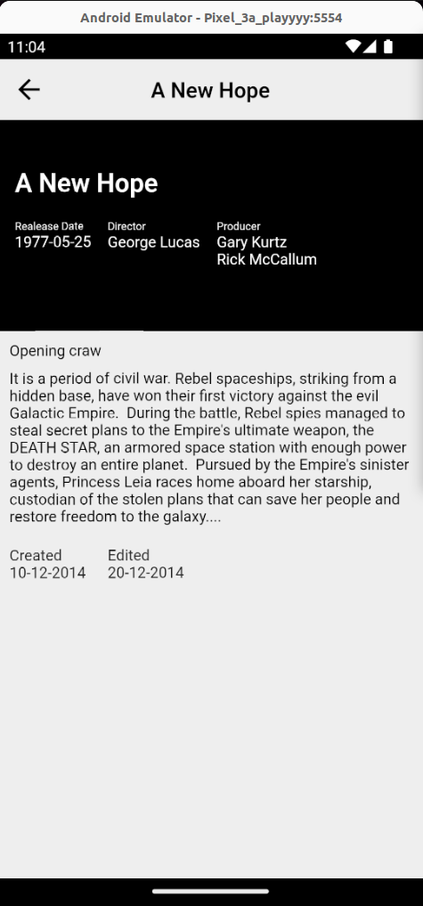

# Think-it Star Wars App

### Overview
#### The Think-it Star Wars App is a simple yet engaging application built with the MVVM architecture. It provides information about Star Wars movies by fetching data from the [Star Wars API](https://swapi.dev/) using the http package. The app leverages the GetX library for state management, navigation, and dependency injection, ensuring a clean and efficient development experience.

### Features
#### Splash Screen: A visually appealing splash screen welcomes users when they launch the app.

#### Home Page: The home page lists Star Wars movies, including their titles, release dates, directors, and producers.

#### Movie Details: Users can tap on a movie to view more details, such as the opening crawl, creation date, and last edit date.

### Architecture
#### The app follows the MVVM architecture, emphasizing modularity and separation of concerns. The use of GetX enhances the development process with its state management capabilities, routing features, and streamlined dependency injection.

### Screenshots

  
  
  
  

### Packages I Used
#### [GetX](https://pub.dev/packages/get): A powerful state management library for Flutter.
#### [http](https://pub.dev/packages/http): A package for making HTTP requests, used to fetch data from the Star Wars API.

Made by [Jaafar Fares](https://jaafarfares.github.io/) for Think-it.
